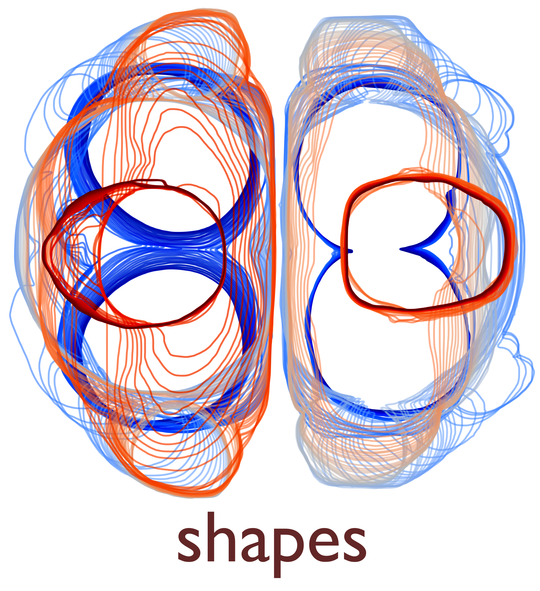

<table  align="center"><td align="center" width="9999">



</td>
<tr>
<td align="left" width="9999" >

<div align="center">

[](https://pypi.org/project/hypertiling/)
[](https://doi.org/10.5281/zenodo.7559393)

</div>

**shapes** is a new project interesting ...

## Installation

To set up, follow these steps after downloading the repository:

**1. Environment Setup**

Create and activate a virtual environment to manage dependencies efficiently:

```bash
pip install uv
uv sync
```

**2. Launch the App**

Start the app with the following command:

```bash
uv run streamlit run src/configuration/streamlit_app/app/app.py
```


## Documentation

Further usage examples and a full API reference are available in our [documentation](https://shapes-crowd.readthedocs.io/en/latest/).

## Authors

* Oscar Dufour
* Maxime Stapelle
* David Rodney
* Alexandre Nicolas

This project is developed at:
[Institute of Light and Matter](https://ilm.univ-lyon1.fr/)

## Citation

If you use _shapes_, we encourage you to cite or reference this work as you would any other scientific research. The package is a result of a huge amount of time and effort invested by the authors. Citing us allows us to measure the impact of the research and encourages others to use the library.

Cite us:
```
@software{dufour_2025_14906931,
    author    = {Dufour, Oscar and Stapelle, Maxime and Rodney, David and Nicolas, Alexandre},
    title     = {CrowdMorph - Realistic Crowd Generator and Simulation},
    month     = {jun},
    year      = {2025},
    publisher = {Zenodo},
    version   = {v1.3.1},
    doi       = {10.5281/zenodo.7559393},
    url       = {https://doi.org/10.5281/zenodo.7559393}
}
```

## Some use cases

### pedestrian crowds


## License
Every part of shapes is available under the MIT license.


